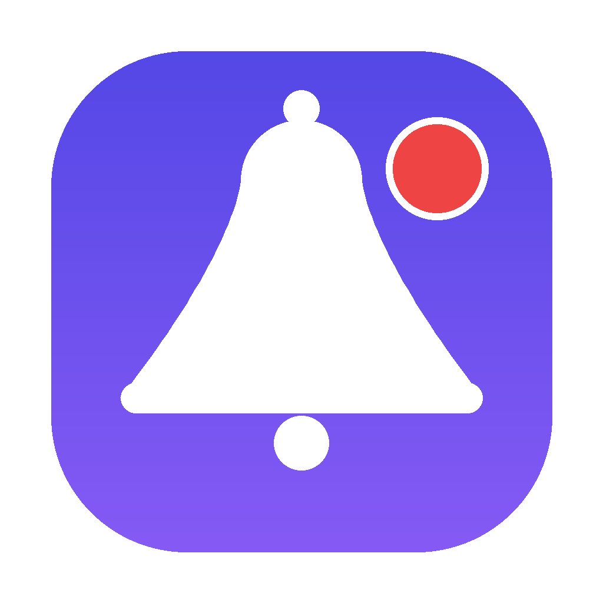

# GitPulse

A lightweight macOS **menu-bar app** to review and get notified about your GitHub notifications — filtered by repository and notification type.



Built because GitHub's own notification noise is hard to filter down to "just the things that mention or are assigned to me." GitPulse lives in the menu bar, shows an unread count for your selected notification types, and fires native desktop banners on a schedule you choose.

## Features

- **Menu-bar item** with a live unread count (bell + number), no Dock clutter.
- **Sign in with GitHub** (OAuth Device Flow) **or** paste a Personal Access Token.
  - PAT is required for **org-private repos** when the OAuth app isn't org-approved.
- **Repository picker** — load every repo you can access, search, and check the ones to watch.
- **Notification-type checkboxes** — mention, team mention, review requested, assigned, comments, CI activity, and more. Drives both the badge and the alerts.
- **Native desktop notifications** (UserNotifications framework) — click a banner to open the issue/PR on GitHub.
- **Reminder interval** — Realtime (30 min), 1h, 2h, 4h, 8h, Daily.
- **Test notification** button, **Mark all read**, **⌘-click / double-click** a row to open it.
- Settings + token stored locally (token in macOS Keychain).

## Requirements

- macOS 13+ (built/tested on macOS 26, Apple Silicon).
- [GitHub CLI not required] — auth is built in.
- To build: Xcode command-line tools (`swiftc`). Icon regeneration needs Python 3 + Pillow (optional).

## Build

```bash
./build.sh
```

Produces `GitPulse.app` and `GitPulse.dmg`.

To regenerate the icon:

```bash
python3 src/makeicon.py   # writes icon_1024.png
# then convert to .icns with iconutil (see build notes)
```

## Install

1. Open `GitPulse.dmg`, drag **GitPulse** to **Applications**.
2. Launch from **/Applications** (first run: right-click → **Open**, ad-hoc signed).
3. Sign in with GitHub, or paste a token (scopes: `notifications`, `repo`).
4. Click **Test notification** → allow notifications when macOS prompts.
5. **Load repos**, check the ones to watch, pick your types, enable notifications.

## Auth notes

- OAuth Device Flow uses a public `client_id` (not a secret).
- For **private org repos** (e.g. on a free-plan org with OAuth-app restrictions), a classic **Personal Access Token** with `notifications` + `repo` scope works without org-owner approval.
- The token is stored only in the **macOS Keychain**; it is never written to the app bundle or config files.

## License

Personal project. Use at your own risk.
